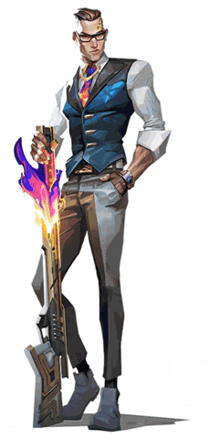

# ⚜️ Shubham Pandey ⚜️

### *"If you're here, you have good taste, my friend."*

### AI Engineer | Agentic AI & GenAI Systems Builder | Computer Vision Specialist

  <a href="mailto:contact.shub.aidev@gmail.com">contact.shub.aidev@gmail.com</a> ·
  <a href="https://www.linkedin.com/in/shubham-pandey-068469358/">LinkedIn</a> ·
  <a href="https://github.com/ShubhamPandey020525">GitHub</a> ·
  <a href="https://www.instagram.com/shub.0205/">Instagram</a>

  

---

> ### “Precision is not a habit. It is a weapon.”
>
> AI Engineer specializing in **Agentic AI, Generative AI, Retrieval-Augmented Generation (RAG), Computer Vision, Deep Learning, and Machine Learning**.  
> I build production-ready systems with clean architecture, real inference, and strong product thinking.

---

## ⚜️ Core Identity

<<<<<<< HEAD
<table width="100%">
  <tr>
    <td width="50%" valign="top">
      <h4>💻 Languages & Frameworks</h4>
      <ul>
        <li><b>Languages</b>: Python, C++</li>
        <li><b>AI & ML</b>: Agentic AI, Generative AI, Deep Learning, Computer Vision, Machine Learning</li>
        <li><b>Frameworks</b>: LangChain, LangGraph, CrewAI, PyTorch, TensorFlow, OpenCV, Scikit-learn, FastAPI</li>
        <li><b>Developer Tools</b>: Git, GitHub, Docker, Streamlit, React</li>
      </ul>
    </td>
    <td width="50%" align="center" valign="middle">
      
    </td>
  </tr>
=======
<table>
<tr>
<td width="50%" valign="top">

### Who I Am
- AI Engineer
- Agentic AI Builder
- GenAI Systems Developer
- Computer Vision Specialist
- RAG Workflow Designer
- Chamber Main

</td>
<td width="50%" valign="top">

### What I Build
- Intelligent AI products
- Multi-agent systems
- Retrieval-based assistants
- Real-time vision pipelines
- Scalable ML applications
- React + FastAPI AI platforms

</td>
</tr>
>>>>>>> 7fc74e9fb2c37ad7f282622d09152f98fe55c7b3
</table>

---

### *"The difference between ordinary and exceptional is attention to detail."*

---

## ⚜️ Arsenal

<table>
<tr>
<td width="50%" valign="top">

### AI & Machine Learning
- Agentic AI
- Generative AI
- Multi-Agent Systems
- RAG Systems
- Deep Learning
- Machine Learning
- Soft Computing
- Computer Vision

</td>
<td width="50%" valign="top">

### Languages & Tools
- Python
- C++
- LangChain
- LangGraph
- CrewAI
- PyTorch
- TensorFlow
- OpenCV
- Scikit-learn
- FastAPI
- React
- Docker
- Git & GitHub

</td>
</tr>
</table>

---

## ⚜️ Current Mission

<table>
<tr>
<td width="50%" valign="top">

- Build sharper Agentic AI systems
- Improve retrieval quality in RAG
- Create vision systems with real-world value
- Blend React + FastAPI into usable AI products

</td>
<td width="50%" valign="top">

- Push multi-agent orchestration further
- Work on long-term memory and reasoning
- Build cleaner deployment pipelines
- Keep every system precise, fast, and scalable

</td>
</tr>
</table>

---

## 🚀 Signature Projects

<table>
<tr>
<td width="50%" valign="top">

### [Finvexis AI — Multi-Agent Intelligence Platform](https://github.com/Riruru612/Finvexis_AI)

**Stack:** LangChain • Multi-Agent Systems • AI Orchestration • FastAPI

- Built a multi-agent AI platform with 12 specialized agents for business, finance, and workflow automation
- Designed for intelligent orchestration and decision support
- Strong focus on automation, business intelligence, and structured AI workflows

> *"A well-placed move is louder than a hundred promises."*

</td>
<td width="50%" valign="top">

### [PolyDoc Chat — RAG Q&A System](https://github.com/ShubhamPandey020525/PolyDoc-Chat)

**Stack:** RAG • FAISS • Semantic Search • FastAPI

- Built a conversational document search and grounded Q&A system
- Optimized document ingestion, chunking, and similarity retrieval
- Reduced hallucinations through retrieval-first design

> *"Truth is easier to find when the system is built correctly."*

</td>
</tr>

<tr>
<td width="50%" valign="top">

### [MoodFlix — AI-Powered Movie Discovery](https://github.com/ShubhamPandey020525/MoodFlix)

**Stack:** Recommendation Systems • React • FastAPI • TMDB API

- Built a mood-based movie recommendation platform
- Added live TMDB sync for fresh content
- Focused on discovery, relevance, and clean UX

> *"Style is nothing without control."*

</td>
<td width="50%" valign="top">

### [Co-Drive — YOLO Traffic Sign Detection](https://github.com/ShubhamPandey020525/Co-Drive)

**Stack:** Computer Vision • YOLOv8 • Deep Learning • GPU Acceleration

- Built a real-time traffic sign detection system for image, video, and webcam inputs
- Optimized for real-time inference
- Achieved **99.05% mAP**

> *"One shot. One result."*

</td>
</tr>

<tr>
<td width="50%" valign="top">

### [EmberGuard — Forest Fire Prediction](https://github.com/ShubhamPandey020525/EmberGuard)

**Stack:** Machine Learning • Soft Computing • Random Forest

- Built a forest fire risk prediction system from environmental data
- Designed for predictive analytics and decision support
- Focused on practical ML for real-world impact

> *"When danger is invisible, precision becomes everything."*

</td>
<td width="50%" valign="top">

### [Munshot — AI Product Platform](https://github.com/ShubhamPandey020525/Munshot)

**Stack:** React • FastAPI • AI Workflows • LLM Systems

- Built an AI-driven product platform for scalable workflows
- Designed for intelligent user interaction
- Focused on modular architecture and product intelligence

> *"Elegance is not decoration. It is discipline."*

</td>
</tr>
</table>

---

## 💼 Experience

<table>
<tr>
<td width="50%" valign="top">

### Smart India Hackathon (SIH)
AI/ML Developer

- Rapid AI prototyping
- Real-world problem solving
- Team-based execution

</td>
<td width="50%" valign="top">

### AI/ML Mentor
Bennett University

- Guided peers in AI/ML concepts
- Helped with project development
- Supported RAG and LLM workflows

</td>
</tr>
</table>

---

## 🎓 Education

<table>
<tr>
<td width="50%" valign="top">

### Bennett University, Greater Noida
**B.Tech in Computer Science Engineering (AI)**  
2023 – 2027

**SGPA:** 8.36  
**CGPA:** 7.9/10

</td>
<td width="50%" valign="top">

### Shiksha Bharati School
**CBSE**  
Class XII and X

**XII:** 84%  
**X:** 91%

</td>
</tr>
</table>

---

### *"They think they are safe. How adorable."*

**Building the future with precision and class.**

