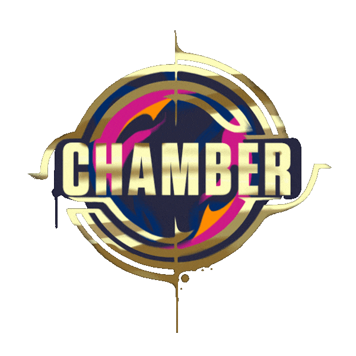

  
  
  <h1>✨ Shubham Pandey ✨</h1>
  
<b>AI Engineer | Agentic AI & GenAI Systems Builder | Computer Vision Specialist</b>

  

    
    
    
  

  
  
📞 <b>+91 8218554651</b>

---

### 📖 Professional Summary
AI Engineer specializing in **Agentic AI, Generative AI, Retrieval-Augmented Generation (RAG), Computer Vision, Deep Learning, and Machine Learning**. Experienced in designing and deploying production-ready AI applications, scalable ML pipelines, and real-time inference systems.

---

### 🛠️ Tech Stack

<table align="center">
  <tr>
    <td align="center" width="25%"><b>Languages</b></td>
    <td width="75%"></td>
  </tr>
  <tr>
    <td align="center"><b>AI & ML</b></td>
    <td>Agentic AI, Generative AI, Deep Learning, Computer Vision, Machine Learning</td>
  </tr>
  <tr>
    <td align="center"><b>Frameworks</b></td>
    <td>   <i>LangChain, LangGraph, CrewAI</i></td>
  </tr>
  <tr>
    <td align="center"><b>Tools</b></td>
    <td>   <i>Streamlit, React</i></td>
  </tr>
</table>

---

### 🚀 Projects

#### � [Finvexis AI — Multi-Agent Intelligence Platform](https://github.com/ShubhamPandey020525/Finvexis-AI)
> **Stack:** LangChain, Multi-Agent Systems, AI Orchestration
- Developed a multi-agent AI platform with 12 specialized agents for business, finance, and workflow automation tasks.
- Integrated AI Orchestration for complex Business Intelligence and Finance Insights.

#### 📄 [PolyDoc Chat — RAG Q&A System](https://github.com/ShubhamPandey020525/PolyDoc-Chat)
> **Stack:** RAG, FAISS, Semantic Search, FastAPI
- Developed a multi-agent RAG system for conversational document search and grounded question answering.
- Optimized Document Ingestion, Chunking, and Similarity Retrieval to reduce hallucinations.

#### 🎬 [MoodFlix — AI-Powered Movie Discovery](https://github.com/ShubhamPandey020525/MoodFlix)
> **Stack:** Recommendation Systems, TMDB API
- Optimized a mood-based movie recommendation platform with live TMDB sync for new releases.
- Features Conversational Discovery and real-time updates.

#### 🚦 [Co-Drive — YOLO Traffic Sign Detection](https://github.com/ShubhamPandey020525/Co-Drive)
> **Stack:** Computer Vision, YOLOv8, GPU Acceleration
- Real-time traffic sign detection system for image, video, and webcam inputs.
- Achieved **99.05% mAP** with optimized real-time inference.

#### 🔥 [EmberGuard Predict — Forest Fire Prediction](https://github.com/ShubhamPandey020525/EmberGuard-Predict)
> **Stack:** Random Forest, Predictive Analytics
- Developed a forest fire risk prediction system using environmental data and machine learning for decision support.

#### 📦 [Munshot — AI Product Platform](https://github.com/ShubhamPandey020525/Munshot)
> **Stack:** Scalable AI Workflows, Modular Architecture
- Architected an AI-driven product platform for scalable workflows and intelligent user interactions.

---

### 💼 Experience
- **Smart India Hackathon (SIH)** | AI/ML Developer
  - Contributed to rapid AI prototyping and real-world problem-solving.
- **AI/ML Mentor**
  - Mentored peers in AI/ML concepts, RAG systems, and LLM-based applications.
- **Collaborator**
  - Worked on team-based projects involving Vector Databases, Semantic Retrieval, and Model Deployment.

---

### 🎓 Education
- **Bennett University, Greater Noida** | B.Tech in Computer Science Engineering (AI) 
  - *2023 – 2027* | Current SGPA: **8.36** | CGPA: **7.9/10**
- **Shiksha Bharati Senior Secondary School** | Class XII (CBSE)
  - *2022 – 2023* | Score: **84%**
- **Shiksha Bharati Senior Secondary School** | Class X (CBSE)
  - *2020 – 2021* | Score: **91%**

---

### 📜 Certifications
- 🎖️ Apply & Build Basic GANs — *DeepLearning.AI*
- 🎖️ Neural Networks and Deep Learning — *DeepLearning.AI*
- 🎖️ Machine Learning: Classification — *University of Washington*
- 🎖️ Statistics for Data Science with Python — *IBM*

---

  
    
  
  <blockquote>
    <i>"Precision is the difference between a butcher and a surgeon."</i>
  </blockquote>
  
  

